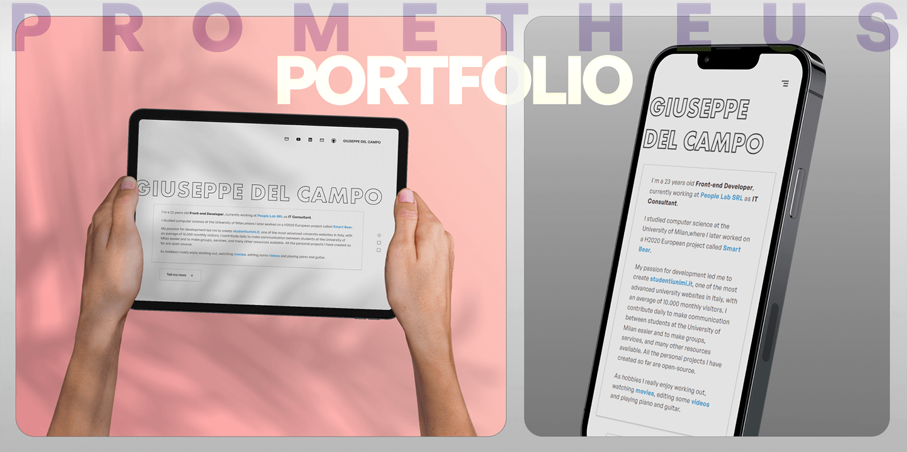

# Prometheus Portfolio
[](https://lbesson.mit-license.org/)
[](https://github.com/Giuseppetm/prometheus-portfolio/issues/)
[](https://app.netlify.com/sites/giuseppedelcampo/deploys)

Minimalist, fully responsive portfolio made with React and NextJS. 🎦 [LIVE PREVIEW](https://giuseppedelcampo.netlify.app/)



## ✨ Features

1. Fully responsive;
2. Possibility to add a description about yourself modifying the `Hero` section;
3. Possibility to add your social links in `Header` and `Footer` components;
4. Possibility to add your projects modifying the `Projects` file in the data folder;
5. Your information is properly indexed on search engines through the use of a specific library called **NextSEO**.
6. Cool performance:

   | Mobile       | Desktop   |
   |--------------|-----------|
   |  |  |

## 🕹️ How to run the project locally

1. Install dependencies
   ```sh
   npm install
   ```

2. Run the development server:

   ```sh
   npm run dev
   ```

For deploys I am currently using [Netlify](https://app.netlify.com/).
